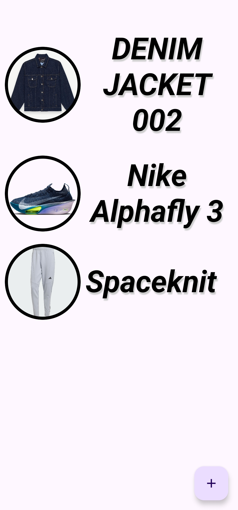
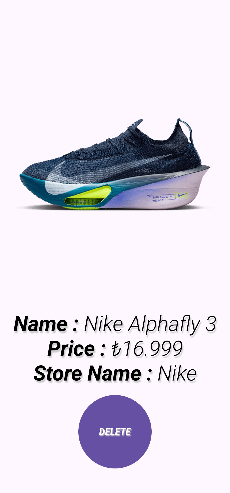

# Wish List (Android • Kotlin • Jetpack Compose)

An Android app to keep a personal wish list. Add items with a name, optional price and store name, attach an image from your gallery, browse your list, view details, and delete when done. Data is stored locally using Room and presented with Jetpack Compose and Material 3.

## Features
- Add wishes with: name, price (optional), store (optional), and image
- Browse your list with a clean Compose UI
- Detail screen with large image and metadata
- Delete items with a confirmation dialog
- Local persistence via Room (SQLite)
- Modern Android stack: Jetpack Compose, Navigation, Material 3, Coil
- MVVM with `AndroidViewModel` and Room DAO

## Tech Stack
- Kotlin `2.2.21` • AGP `8.13.1` • KSP
- Jetpack Compose (BOM `2025.11.00`), Material 3
- Navigation Compose
- Room (runtime, ktx, compiler via KSP)
- Lifecycle: ViewModel, LiveData, Runtime Compose
- Coil 3 for image loading

## App Info
- Package: `com.receparslan.wishlist`
- Module: `:app`
- `minSdk` 24 • `targetSdk` 36 • `compileSdk` 36
- JVM toolchain: 21

## Permissions and Media Picker
- Android 13+ (API 33+): Uses the system Photo Picker — no storage permission required.
- Android 12 and below: Requests `READ_EXTERNAL_STORAGE` to pick an image from gallery (declared with `maxSdkVersion=32`).

## Project Structure
```
app/
  src/main/
    java/com/receparslan/wishlist/
      MainActivity.kt                # NavHost and routes
      model/Item.kt                  # Room entity
      roomDB/InventoryDatabase.kt    # Room database
      roomDB/ItemDAO.kt              # DAO (insert/delete/query)
      viewmodel/ItemViewModel.kt     # MVVM state + Room calls
      ui/screens/                    # Compose screens
        ListScreen.kt                # List with FAB
        AddItemScreen.kt             # Form + image picker
        DetailScreen.kt              # Detail + delete dialog
    AndroidManifest.xml
```

## Screenshots

| List Screen                                                           | Detail Screen                                                             | Add Screen                                                          |
|-----------------------------------------------------------------------|---------------------------------------------------------------------------|---------------------------------------------------------------------|
|  |  |  |

## Getting Started
### Open in Android Studio (recommended)
1. File → Open → select the project root
2. Let Gradle sync and index
3. Run on device or emulator (API 24+)

### Build from Terminal (Windows PowerShell)
From the project root:

```powershell
# Clean and assemble debug APK
.\gradlew.bat clean
.\gradlew.bat :app:assembleDebug

# (Optional) Install to a connected device
adb install -r .\app\build\outputs\apk\debug\app-debug.apk
```

## Usage Notes
- On Android 12 and below, the app will request storage permission when selecting an image from the gallery.
- Images are resized before being stored to reduce size.

## License
This project is licensed under the MIT License — see [LICENSE](LICENSE) for details.

## Acknowledgements
- Jetpack libraries by AndroidX
- Coil for image loading
